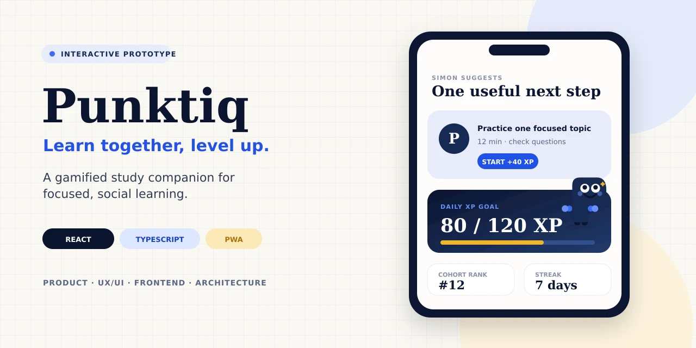
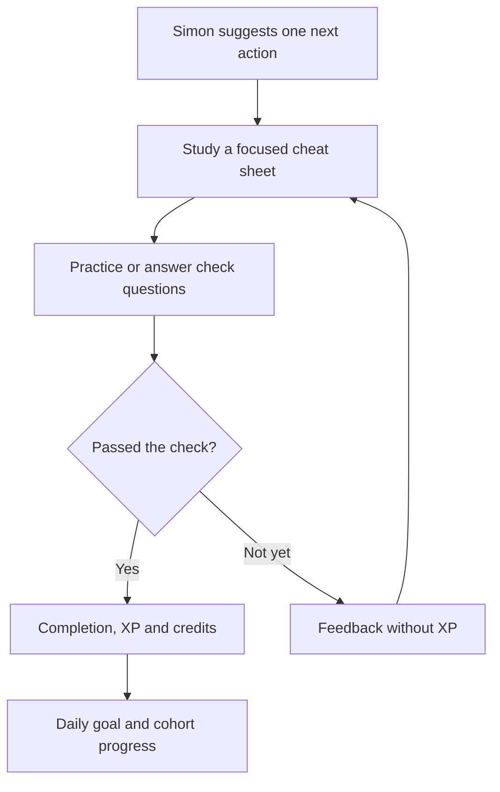
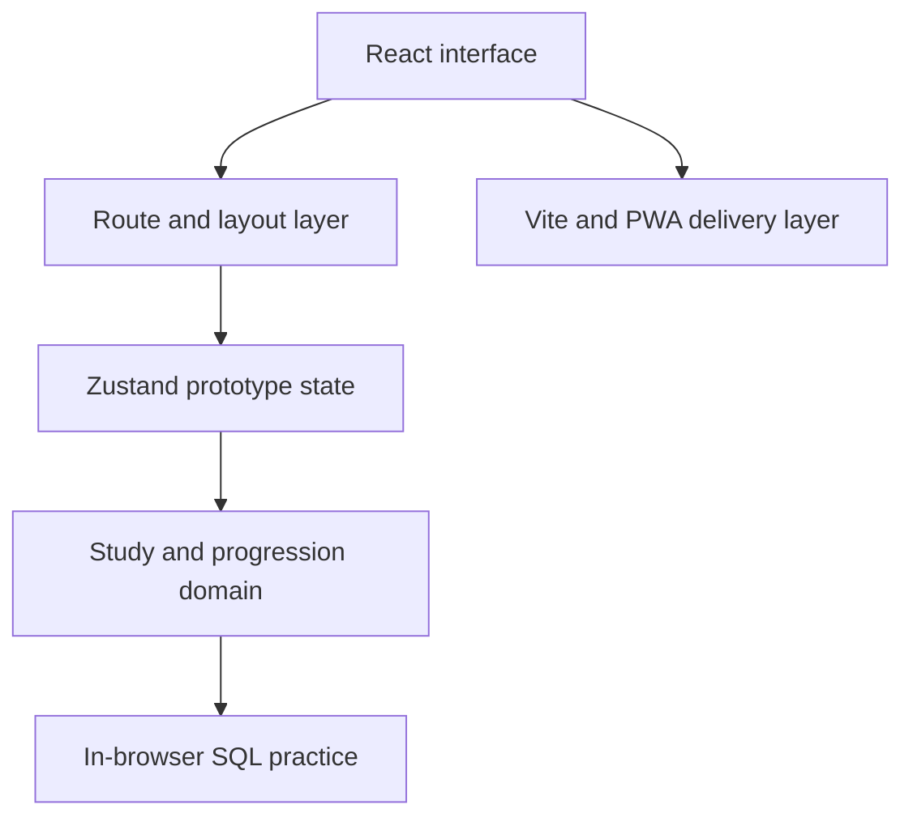

  

<h1 align="center">Punktiq</h1>

<strong>Learn together, level up.</strong>

  
  
  
  
  

> **Portfolio showcase:** the Punktiq application source code is maintained privately and is not included in this repository.

Punktiq is a mobile-first study companion prototype that turns short, verified learning activities into visible progress. It combines focused study material, check questions, in-browser SQL practice, daily goals, XP, academic cohort leaderboards, private notes, and a companion named Simon.

The initial product context is KdG Applied Computer Science. Punktiq is an independent student project and is not affiliated with or endorsed by Karel de Grote University of Applied Sciences and Arts.

## Why Punktiq

Study tools often separate content, practice, motivation, and peer context into different systems. That makes it easy to read passively, lose track of progress, or chase a streak without proving that anything was learned.

Punktiq explores a tighter loop: suggest one useful next action, verify it with a short check or practical task, reward completion, and reflect the result in personal and cohort progress.

## Core learning loop

XP represents verified study progress. Credits are a separate cosmetic currency for Simon. A failed attempt gives feedback but does not award XP.

## Product experience

| Area | What the prototype demonstrates |
| --- | --- |
| Start | Onboarding, mock sign-in, academic profile setup, and a dashboard organised around one Simon recommendation |
| Study | Course-filtered library, focused readers, check questions, progress states, and private note capture |
| Practice | SQL exercises executed and compared locally in the browser before continuing to the knowledge check |
| Progress | Daily XP target, streaks, goals, completion rewards, rank movement, and cohort/course/programme/friends scopes |
| Companion | Simon moods, reactions, encouragement, and cosmetics purchased with credits rather than XP |
| Administration | Prototype dashboard for seasons and integrity alerts; deeper admin sections remain outside the current MVP |

## Simon Buddy

  

Simon is not a generic chatbot. In the prototype, Simon gives the home screen a single next action, changes mood with progress, reacts to completion, and makes the reward layer feel personal without replacing the learning task itself.

## Technical overview

| Concern | Prototype approach |
| --- | --- |
| Interface | React 19 and TypeScript, designed mobile-first |
| Navigation | React Router with focused-study and main-navigation layouts |
| State | Zustand with local persistence for prototype sessions |
| Styling | Tailwind CSS with a custom navy, academic-blue, paper, and gold system |
| SQL practice | `sql.js` runs a contained SQLite-compatible exercise environment in the browser |
| Delivery | Vite build, PWA metadata, and deployment configuration |

The architecture is intentionally local-first and mock-driven at this stage. There is no production authentication service, institutional integration, or multi-user backend in the public claim set.

More detail is available in the [architecture overview](docs/architecture-overview.md), without exposing application source or the private content corpus.

## Product principles

- **One useful next step:** the home experience prioritises a concrete action over an endless feed.
- **Evidence before reward:** XP follows a passed check, not simply opening content.
- **Motivation without pay-to-win:** credits and cosmetics are separate from academic progress.
- **Academic peer context:** leaderboards use cohort, course, programme, and friends scopes instead of arbitrary global leagues.
- **Privacy by default:** rankings show screen names; real-name visibility is not assumed.
- **Auditable administration:** integrity review and season-closing actions are represented as explicit product concepts.

## Fair progression and privacy

The prototype models several safeguards:

- failed attempts provide feedback but no XP;
- a completed study item cannot grant the same reward repeatedly;
- leaderboard position is derived from XP rather than manually simulated;
- rankings use screen names by default;
- integrity alerts can be reviewed rather than silently punishing a learner;
- administrative actions have an auditable domain model.

These are product-design decisions demonstrated in a prototype, not claims of production-grade anti-fraud or security.

## Current status

**Interactive prototype / work in progress**

The prototype contains navigable flows for onboarding, profile setup, the study dashboard, library, readers, SQL practice, check questions, completion rewards, goals, notes, scoped leaderboards, Simon Buddy, and an admin overview. Authentication and data are mocked/local, cohort entries are samples, and several deeper admin pages are explicit placeholders.

Course-specific content, question banks, source code, real user data, and internal project files are intentionally excluded from this showcase.

## Roadmap

The next product questions are less about adding screens and more about validating the system:

- replace mock identity and local-only state with an appropriate backend boundary;
- test the study loop and reward semantics with consenting students;
- complete accessibility and keyboard/screen-reader reviews;
- validate leaderboard fairness, opt-out behaviour, and daily caps;
- expand automated tests around attempts, rewards, streaks, and rank updates;
- finish the remaining admin workflows only after their real operational needs are clear.

See the [full roadmap](docs/roadmap.md).

## My contribution

**Bohdan Dron — Product concept, UX/UI direction, frontend implementation, application architecture, and prototype iteration.**

The project demonstrates work across:

- product definition and scope control;
- mobile-first interaction design;
- component-based React development;
- typed domain and state modelling;
- gamification and reward-system design;
- local SQL execution and result checking;
- privacy, fairness, and integrity considerations;
- technical documentation and portfolio communication.

## Documentation

- [Product overview](docs/product-overview.md)
- [Architecture overview](docs/architecture-overview.md)
- [Roadmap](docs/roadmap.md)

## Project notice

Punktiq is an independent student project and is not affiliated with or endorsed by Karel de Grote University of Applied Sciences and Arts. Product names and institutional references are used only to explain the prototype's educational context.

The contents of this showcase are provided for portfolio viewing only. See [LICENSE.md](LICENSE.md) and [NOTICE.md](NOTICE.md).

© 2026 [Bohdan Dron](https://github.com/gogolumo). All rights reserved.
