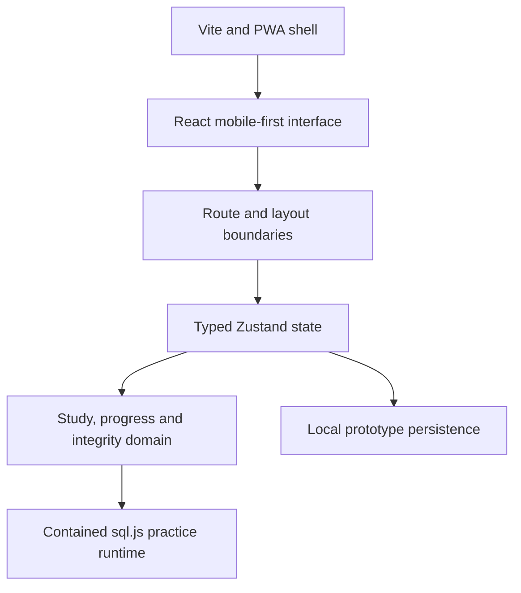

# Punktiq Architecture Overview

This document describes the prototype at a portfolio level. It intentionally excludes source code, private content, implementation algorithms, and the internal question corpus.

## Runtime shape

## Interface and navigation

The prototype uses React and TypeScript. Navigation separates focused tasks such as onboarding, reading, practice, and checks from the persistent mobile-navigation areas such as Home, Library, Leaderboard, Goals, Notes, and Simon.

An additional desktop-oriented admin layout demonstrates season and integrity concepts. Its overview contains prototype interactions; several deeper routes are placeholders and are not represented as complete features.

## State and domain model

Zustand holds typed prototype state and actions. The conceptual model separates:

- student profile and academic cohort;
- study items and questions;
- attempts and successful completions;
- XP from cosmetic credits;
- goals, missions, notes, and deadlines;
- leaderboard scopes and entries;
- Simon mood and cosmetic state;
- seasons, integrity alerts, and audit records.

This separation matters because opening content, attempting a check, passing it, receiving a reward, and updating rank are not the same event.

## Progression boundary

The prototype treats a passed check as the reward boundary. A failed attempt is retained for feedback but does not create a completion or grant XP. A completed study item is guarded against repeat rewards, and leaderboard positions are recalculated from XP.

This is a prototype implementation of a product rule, not a claim of server-enforced production integrity.

## In-browser SQL practice

`sql.js` provides a contained SQLite-compatible runtime in the browser. An exercise supplies a small synthetic dataset, the learner runs a query, and the resulting table can be compared with the expected result before continuing.

Benefits for the prototype:

- immediate feedback without provisioning a database server;
- deterministic sample data;
- a focused practice surface within the learning flow;
- no dependency on institutional systems.

Production use would require additional sandboxing, content governance, telemetry decisions, and accessibility testing.

## Persistence and authentication

The current state is persisted locally for prototype continuity. Sign-in is a mock gate rather than real identity verification. There is no production backend, cross-device sync, institutional single sign-on, or server-side authorisation in the current claim set.

## Delivery

The private prototype uses a Vite build and includes PWA metadata and deployment configuration. A successful deployment status exists in the private development history, but this showcase does not publish a live-demo link because frontend bundles can be inspected in a browser and no public URL has been approved for release.

## Security and privacy posture

The prototype is suitable for demonstrating product flows and architecture decisions, not for storing real academic or personal data. Any production evolution would need, at minimum:

- real authentication and authorisation;
- server-side reward enforcement;
- data minimisation and retention rules;
- consent and leaderboard opt-out;
- abuse and appeal workflows;
- secure secret management;
- privacy review and threat modelling;
- accessibility and automated test coverage.
